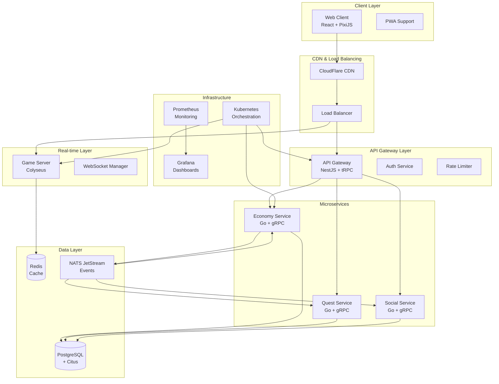

# Design Document - Complete CityVille Game

## Overview

This design document outlines the complete architecture and implementation strategy for CityVille 2025, transforming the current foundational project into a fully functional city building game. The design leverages the existing monorepo structure, microservices architecture, and technology stack while implementing all core game systems, user interfaces, and infrastructure components.

The system will support 100,000+ concurrent players with real-time multiplayer capabilities, economic simulation, quest progression, and social features, all delivered through a high-performance web platform with comprehensive monitoring and scalability.

## Architecture

### High-Level System Architecture



### Technology Stack Implementation

#### Frontend Architecture
- **Framework**: React 18 with TypeScript for component-based UI
- **Game Engine**: PixiJS v8 for WebGL-accelerated 2D rendering
- **State Management**: Zustand for client state + React Query for server state
- **Styling**: CSS Modules with PostCSS for component styling
- **Build Tool**: Vite for development, Webpack for production optimization
- **PWA**: Service Worker for offline capabilities and app-like experience

#### Backend Architecture
- **API Gateway**: NestJS with Express providing tRPC endpoints
- **Real-time Server**: Colyseus for WebSocket-based multiplayer rooms
- **Microservices**: Go with Gin framework for high-performance business logic
- **Message Queue**: NATS JetStream for event sourcing and inter-service communication
- **Database**: PostgreSQL 16 with Citus extension for horizontal sharding
- **Cache**: Redis for session management and frequently accessed data

#### Infrastructure Architecture
- **Orchestration**: Kubernetes (AKS/EKS) with Helm charts
- **CI/CD**: GitHub Actions with automated testing and deployment
- **Monitoring**: Prometheus + Grafana + Jaeger for comprehensive observability
- **Security**: JWT authentication, rate limiting, and HTTPS/WSS encryption

## Components and Interfaces

### Frontend Components

#### Core Game Components

```typescript
// Game Engine Core
interface GameEngine {
  renderer: PixiRenderer;
  entityManager: EntityManager;
  systemManager: SystemManager;
  inputManager: InputManager;
  audioManager: AudioManager;
}

// Entity Component System
interface Entity {
  id: string;
  components: Map<ComponentType, Component>;
}

interface Component {
  type: ComponentType;
  data: Record<string, any>;
}

// Core Components
interface PositionComponent extends Component {
  type: 'position';
  data: {
    x: number;
    y: number;
    z: number;
  };
}

interface SpriteComponent extends Component {
  type: 'sprite';
  data: {
    texture: string;
    scale: number;
    rotation: number;
    tint: number;
  };
}

interface BuildingComponent extends Component {
  type: 'building';
  data: {
    buildingType: string;
    level: number;
    lastCollected: number;
    rentAmount: number;
    constructionTime: number;
    isConstructed: boolean;
  };
}
```

#### UI Component Library

```typescript
// Base UI Components
interface ButtonProps {
  variant: 'primary' | 'secondary' | 'danger';
  size: 'small' | 'medium' | 'large';
  disabled?: boolean;
  loading?: boolean;
  onClick: () => void;
  children: React.ReactNode;
}

interface ModalProps {
  isOpen: boolean;
  onClose: () => void;
  title: string;
  size: 'small' | 'medium' | 'large' | 'fullscreen';
  children: React.ReactNode;
}

// Game-specific UI Components
interface BuildingCardProps {
  building: BuildingType;
  canAfford: boolean;
  onSelect: (building: BuildingType) => void;
}

interface ResourceDisplayProps {
  coins: number;
  cityCash: number;
  energy: number;
  maxEnergy: number;
  population: number;
}

interface CityGridProps {
  gridSize: { width: number; height: number };
  buildings: Building[];
  selectedTile?: { x: number; y: number };
  onTileClick: (x: number, y: number) => void;
  onBuildingClick: (building: Building) => void;
}
```

### Backend Service Interfaces

#### API Gateway Contracts

```typescript
// tRPC Router Definitions
interface PlayerRouter {
  getStats: Procedure<{ userId?: string }, PlayerStats>;
  updateEnergy: Procedure<{ amount: number }, EnergyUpdate>;
  levelUp: Procedure<void, LevelUpResult>;
  getLeaderboard: Procedure<LeaderboardQuery, LeaderboardResult>;
}

interface BuildingRouter {
  list: Procedure<void, Building[]>;
  build: Procedure<BuildBuildingRequest, BuildBuildingResult>;
  collectRent: Procedure<{ buildingId: string }, CollectRentResult>;
  upgrade: Procedure<{ buildingId: string }, UpgradeBuildingResult>;
  getBuildingInfo: Procedure<{ buildingType: string }, BuildingTypeInfo>;
}

interface QuestRouter {
  getActive: Procedure<void, Quest[]>;
  complete: Procedure<{ questId: string }, QuestCompletionResult>;
  claimReward: Procedure<{ questId: string }, RewardClaimResult>;
}

interface SocialRouter {
  getFriends: Procedure<void, Friend[]>;
  visitCity: Procedure<{ friendId: string }, CityVisitResult>;
  sendGift: Procedure<{ friendId: string; giftType: string }, GiftSendResult>;
  helpFriend: Procedure<{ friendId: string; buildingId: string }, HelpResult>;
}
```

#### Microservice gRPC Interfaces

```protobuf
// Economy Service
service EconomyService {
  rpc ProcessTransaction(TransactionRequest) returns (TransactionResponse);
  rpc GetPlayerBalance(BalanceRequest) returns (BalanceResponse);
  rpc CalculateRent(RentCalculationRequest) returns (RentCalculationResponse);
  rpc ValidatePurchase(PurchaseValidationRequest) returns (PurchaseValidationResponse);
  rpc ProcessBulkTransactions(BulkTransactionRequest) returns (BulkTransactionResponse);
}

// Quest Service
service QuestService {
  rpc GetActiveQuests(ActiveQuestsRequest) returns (ActiveQuestsResponse);
  rpc UpdateProgress(ProgressUpdateRequest) returns (ProgressUpdateResponse);
  rpc CompleteQuest(CompleteQuestRequest) returns (CompleteQuestResponse);
  rpc GenerateDailyQuests(DailyQuestRequest) returns (DailyQuestResponse);
  rpc GetQuestTemplates(QuestTemplateRequest) returns (QuestTemplateResponse);
}

// Social Service
service SocialService {
  rpc GetFriendsList(FriendsListRequest) returns (FriendsListResponse);
  rpc ProcessCityVisit(CityVisitRequest) returns (CityVisitResponse);
  rpc SendGift(GiftRequest) returns (GiftResponse);
  rpc ProcessFriendHelp(FriendHelpRequest) returns (FriendHelpResponse);
  rpc UpdateFriendshipLevel(FriendshipUpdateRequest) returns (FriendshipUpdateResponse);
}
```

#### Real-time Server Schema

```typescript
// Colyseus Room State
class CityRoomState extends Schema {
  @type({ map: Player }) players = new MapSchema<Player>();
  @type({ map: Building }) buildings = new MapSchema<Building>();
  @type('number') lastUpdate: number;
  @type('string') roomId: string;
  @type('number') maxPlayers: number = 50;
}

class Player extends Schema {
  @type('string') id: string;
  @type('string') username: string;
  @type('number') level: number;
  @type('number') coins: number;
  @type('number') cityCash: number;
  @type('number') energy: number;
  @type('number') maxEnergy: number;
  @type('boolean') online: boolean;
  @type('number') lastActivity: number;
}

class Building extends Schema {
  @type('string') id: string;
  @type('string') ownerId: string;
  @type('string') type: string;
  @type('number') x: number;
  @type('number') y: number;
  @type('number') level: number;
  @type('number') lastCollected: number;
  @type('boolean') isConstructed: boolean;
  @type('boolean') canCollect: boolean;
  @type('number') rentAmount: number;
}
```

## Data Models

### Database Schema Design

#### Core Player Data

```sql
-- Players table with sharding
CREATE TABLE players (
    id UUID PRIMARY KEY DEFAULT gen_random_uuid(),
    user_id VARCHAR(255) UNIQUE NOT NULL,
    username VARCHAR(50) NOT NULL,
    email VARCHAR(255) UNIQUE NOT NULL,
    level INTEGER DEFAULT 1,
    experience INTEGER DEFAULT 0,
    coins BIGINT DEFAULT 1000,
    city_cash INTEGER DEFAULT 50,
    energy INTEGER DEFAULT 30,
    max_energy INTEGER DEFAULT 30,
    last_energy_update TIMESTAMP DEFAULT NOW(),
    city_name VARCHAR(100) DEFAULT 'My City',
    tutorial_completed BOOLEAN DEFAULT FALSE,
    settings JSONB DEFAULT '{}',
    last_login TIMESTAMP DEFAULT NOW(),
    created_at TIMESTAMP DEFAULT NOW(),
    updated_at TIMESTAMP DEFAULT NOW()
);

-- Distributed table for horizontal scaling
SELECT create_distributed_table('players', 'user_id');
```

#### Building and City Data

```sql
-- Buildings table
CREATE TABLE buildings (
    id UUID PRIMARY KEY DEFAULT gen_random_uuid(),
    user_id VARCHAR(255) NOT NULL,
    building_type VARCHAR(50) NOT NULL,
    position_x INTEGER NOT NULL,
    position_y INTEGER NOT NULL,
    level INTEGER DEFAULT 1,
    last_collected TIMESTAMP,
    construction_started TIMESTAMP DEFAULT NOW(),
    construction_completed TIMESTAMP,
    is_constructed BOOLEAN DEFAULT FALSE,
    metadata JSONB DEFAULT '{}',
    created_at TIMESTAMP DEFAULT NOW(),
    updated_at TIMESTAMP DEFAULT NOW(),
    
    CONSTRAINT unique_position_per_user UNIQUE(user_id, position_x, position_y),
    CONSTRAINT valid_position CHECK (position_x >= 0 AND position_y >= 23),
    CONSTRAINT valid_level CHECK (level >= 1 AND level <= 10)
);

SELECT create_distributed_table('buildings', 'user_id');

-- Building types reference table
CREATE TABLE building_types (
    id VARCHAR(50) PRIMARY KEY,
    name VARCHAR(100) NOT NULL,
    category VARCHAR(50) NOT NULL, -- 'residential', 'commercial', 'productive', 'decoration'
    base_cost INTEGER NOT NULL,
    base_income INTEGER DEFAULT 0,
    income_interval INTEGER DEFAULT 3600, -- seconds
    energy_cost INTEGER DEFAULT 3,
    unlock_level INTEGER DEFAULT 1,
    max_level INTEGER DEFAULT 5,
    size_x INTEGER DEFAULT 1,
    size_y INTEGER DEFAULT 1,
    population_capacity INTEGER DEFAULT 0,
    population_required INTEGER DEFAULT 0,
    sprite_config JSONB DEFAULT '{}',
    created_at TIMESTAMP DEFAULT NOW()
);

SELECT create_reference_table('building_types');
```

#### Economic Transaction Data

```sql
-- Transactions for audit trail
CREATE TABLE transactions (
    id UUID PRIMARY KEY DEFAULT gen_random_uuid(),
    user_id VARCHAR(255) NOT NULL,
    transaction_type VARCHAR(50) NOT NULL,
    amount BIGINT NOT NULL,
    currency VARCHAR(20) NOT NULL, -- 'coins', 'city_cash', 'energy'
    reference_id UUID,
    reference_type VARCHAR(50), -- 'building', 'quest', 'iap', 'gift'
    balance_before BIGINT NOT NULL,
    balance_after BIGINT NOT NULL,
    metadata JSONB DEFAULT '{}',
    created_at TIMESTAMP DEFAULT NOW()
);

SELECT create_distributed_table('transactions', 'user_id');
```

#### Quest and Social Data

```sql
-- Quest progress tracking
CREATE TABLE quest_progress (
    id UUID PRIMARY KEY DEFAULT gen_random_uuid(),
    user_id VARCHAR(255) NOT NULL,
    quest_id VARCHAR(100) NOT NULL,
    quest_type VARCHAR(50) NOT NULL, -- 'tutorial', 'daily', 'weekly', 'achievement'
    status VARCHAR(20) DEFAULT 'active', -- 'active', 'completed', 'claimed'
    progress JSONB DEFAULT '{}',
    started_at TIMESTAMP DEFAULT NOW(),
    completed_at TIMESTAMP,
    claimed_at TIMESTAMP,
    expires_at TIMESTAMP,
    
    CONSTRAINT unique_user_quest UNIQUE(user_id, quest_id)
);

SELECT create_distributed_table('quest_progress', 'user_id');

-- Social relationships
CREATE TABLE friendships (
    id UUID PRIMARY KEY DEFAULT gen_random_uuid(),
    user_id VARCHAR(255) NOT NULL,
    friend_id VARCHAR(255) NOT NULL,
    status VARCHAR(20) DEFAULT 'pending', -- 'pending', 'accepted', 'blocked'
    friendship_level INTEGER DEFAULT 1,
    last_interaction TIMESTAMP,
    created_at TIMESTAMP DEFAULT NOW(),
    
    CONSTRAINT no_self_friendship CHECK (user_id != friend_id),
    CONSTRAINT unique_friendship UNIQUE(user_id, friend_id)
);

SELECT create_distributed_table('friendships', 'user_id');
```

### Redis Cache Schema

```typescript
// Game state caching
interface GameStateCache {
  [`game:${userId}`]: {
    energy: {
      current: number;
      max: number;
      lastUpdate: number;
    };
    buildings: {
      [buildingId: string]: {
        lastCollected: number;
        isReady: boolean;
        rentAmount: number;
      };
    };
    activeQuests: string[];
    lastActivity: number;
    ttl: number; // 1 hour
  };
}

// Session management
interface SessionCache {
  [`session:${sessionId}`]: {
    userId: string;
    roomId: string;
    connectedAt: number;
    lastPing: number;
    ttl: number; // 24 hours
  };
}

// Rate limiting
interface RateLimitCache {
  [`ratelimit:${userId}:${action}`]: {
    count: number;
    resetAt: number;
    ttl: number;
  };
}
```

## Error Handling

### Client-Side Error Handling

```typescript
// Global error boundary
class GameErrorBoundary extends React.Component {
  state = { hasError: false, error: null };
  
  static getDerivedStateFromError(error: Error) {
    return { hasError: true, error };
  }
  
  componentDidCatch(error: Error, errorInfo: React.ErrorInfo) {
    // Log to monitoring service
    logger.error('React error boundary caught error', {
      error: error.message,
      stack: error.stack,
      componentStack: errorInfo.componentStack
    });
  }
  
  render() {
    if (this.state.hasError) {
      return <ErrorFallback error={this.state.error} />;
    }
    return this.props.children;
  }
}

// API error handling
class APIError extends Error {
  constructor(
    message: string,
    public statusCode: number,
    public code: string,
    public details?: any
  ) {
    super(message);
    this.name = 'APIError';
  }
}

// tRPC error handling
const trpcClient = createTRPCReact<AppRouter>({
  links: [
    httpBatchLink({
      url: '/api/trpc',
      fetch(url, options) {
        return fetch(url, {
          ...options,
          credentials: 'include',
        }).catch(error => {
          // Network error handling
          throw new APIError(
            'Network error occurred',
            0,
            'NETWORK_ERROR',
            error
          );
        });
      },
    }),
  ],
});
```

### Server-Side Error Handling

```typescript
// Global exception filter (NestJS)
@Catch()
export class GlobalExceptionFilter implements ExceptionFilter {
  private readonly logger = new Logger(GlobalExceptionFilter.name);
  
  catch(exception: unknown, host: ArgumentsHost) {
    const ctx = host.switchToHttp();
    const response = ctx.getResponse<Response>();
    const request = ctx.getRequest<Request>();
    
    let status = 500;
    let message = 'Internal server error';
    let code = 'INTERNAL_ERROR';
    
    if (exception instanceof HttpException) {
      status = exception.getStatus();
      message = exception.message;
      code = exception.constructor.name;
    } else if (exception instanceof Error) {
      message = exception.message;
      code = exception.constructor.name;
    }
    
    // Log error with context
    this.logger.error('Exception caught', {
      error: message,
      stack: exception instanceof Error ? exception.stack : undefined,
      url: request.url,
      method: request.method,
      userId: request.user?.id,
      timestamp: new Date().toISOString()
    });
    
    response.status(status).json({
      success: false,
      error: {
        code,
        message,
        timestamp: new Date().toISOString(),
        path: request.url
      }
    });
  }
}

// Circuit breaker for external services
class CircuitBreaker {
  private failures = 0;
  private lastFailureTime = 0;
  private state: 'CLOSED' | 'OPEN' | 'HALF_OPEN' = 'CLOSED';
  
  constructor(
    private threshold: number = 5,
    private timeout: number = 60000
  ) {}
  
  async execute<T>(operation: () => Promise<T>): Promise<T> {
    if (this.state === 'OPEN') {
      if (Date.now() - this.lastFailureTime > this.timeout) {
        this.state = 'HALF_OPEN';
      } else {
        throw new Error('Circuit breaker is OPEN');
      }
    }
    
    try {
      const result = await operation();
      this.onSuccess();
      return result;
    } catch (error) {
      this.onFailure();
      throw error;
    }
  }
  
  private onSuccess() {
    this.failures = 0;
    this.state = 'CLOSED';
  }
  
  private onFailure() {
    this.failures++;
    this.lastFailureTime = Date.now();
    
    if (this.failures >= this.threshold) {
      this.state = 'OPEN';
    }
  }
}
```

### Database Error Handling

```typescript
// Database connection with retry logic
class DatabaseManager {
  private pool: Pool;
  private circuitBreaker: CircuitBreaker;
  
  constructor() {
    this.pool = new Pool({
      connectionString: process.env.DATABASE_URL,
      max: 20,
      idleTimeoutMillis: 30000,
      connectionTimeoutMillis: 2000,
    });
    
    this.circuitBreaker = new CircuitBreaker(5, 30000);
  }
  
  async query<T>(sql: string, params?: any[]): Promise<T[]> {
    return this.circuitBreaker.execute(async () => {
      const client = await this.pool.connect();
      try {
        const result = await client.query(sql, params);
        return result.rows;
      } catch (error) {
        if (error.code === '23505') { // Unique violation
          throw new APIError('Duplicate entry', 409, 'DUPLICATE_ENTRY');
        } else if (error.code === '23503') { // Foreign key violation
          throw new APIError('Invalid reference', 400, 'INVALID_REFERENCE');
        }
        throw error;
      } finally {
        client.release();
      }
    });
  }
}
```

## Testing Strategy

### Frontend Testing

```typescript
// Component testing with React Testing Library
describe('BuildingCard Component', () => {
  it('should display building information correctly', () => {
    const building = {
      id: 'house',
      name: 'House',
      cost: 100,
      income: 25,
      category: 'residential'
    };
    
    render(<BuildingCard building={building} canAfford={true} onSelect={jest.fn()} />);
    
    expect(screen.getByText('House')).toBeInTheDocument();
    expect(screen.getByText('100')).toBeInTheDocument();
    expect(screen.getByText('25/hour')).toBeInTheDocument();
  });
  
  it('should disable selection when player cannot afford', () => {
    const building = { id: 'mansion', name: 'Mansion', cost: 5000 };
    const onSelect = jest.fn();
    
    render(<BuildingCard building={building} canAfford={false} onSelect={onSelect} />);
    
    const button = screen.getByRole('button');
    expect(button).toBeDisabled();
    
    fireEvent.click(button);
    expect(onSelect).not.toHaveBeenCalled();
  });
});

// Game engine testing
describe('GameEngine', () => {
  let engine: GameEngine;
  
  beforeEach(() => {
    engine = new GameEngine();
  });
  
  it('should initialize with default systems', () => {
    expect(engine.systemManager.getSystems()).toHaveLength(5);
    expect(engine.systemManager.hasSystem('RenderSystem')).toBe(true);
    expect(engine.systemManager.hasSystem('InputSystem')).toBe(true);
  });
  
  it('should handle entity creation and destruction', () => {
    const entity = engine.entityManager.createEntity();
    expect(engine.entityManager.getEntity(entity.id)).toBeDefined();
    
    engine.entityManager.destroyEntity(entity.id);
    expect(engine.entityManager.getEntity(entity.id)).toBeUndefined();
  });
});
```

### Backend Testing

```typescript
// Service unit testing
describe('BuildingService', () => {
  let service: BuildingService;
  let mockRepository: jest.Mocked<BuildingRepository>;
  let mockEconomyService: jest.Mocked<EconomyService>;
  
  beforeEach(() => {
    mockRepository = createMockRepository();
    mockEconomyService = createMockEconomyService();
    service = new BuildingService(mockRepository, mockEconomyService);
  });
  
  describe('buildBuilding', () => {
    it('should successfully build a building', async () => {
      const userId = 'user123';
      const buildingType = 'house';
      const position = { x: 5, y: 5 };
      
      mockEconomyService.getBalance.mockResolvedValue({ coins: 1000 });
      mockEconomyService.processTransaction.mockResolvedValue({ success: true });
      mockRepository.create.mockResolvedValue({
        id: 'building123',
        userId,
        buildingType,
        ...position
      });
      
      const result = await service.buildBuilding(userId, buildingType, position);
      
      expect(result.success).toBe(true);
      expect(mockEconomyService.processTransaction).toHaveBeenCalledWith({
        userId,
        type: 'building_purchase',
        amount: -100,
        currency: 'coins'
      });
    });
    
    it('should fail with insufficient funds', async () => {
      mockEconomyService.getBalance.mockResolvedValue({ coins: 50 });
      
      await expect(
        service.buildBuilding('user123', 'house', { x: 5, y: 5 })
      ).rejects.toThrow('Insufficient funds');
    });
  });
});

// Integration testing
describe('Building API Integration', () => {
  let app: INestApplication;
  let authToken: string;
  
  beforeAll(async () => {
    const moduleFixture = await Test.createTestingModule({
      imports: [AppModule],
    }).compile();
    
    app = moduleFixture.createNestApplication();
    await app.init();
    
    authToken = await getTestAuthToken();
  });
  
  afterAll(async () => {
    await app.close();
  });
  
  it('should build a building successfully', async () => {
    return request(app.getHttpServer())
      .post('/api/buildings/build')
      .set('Authorization', `Bearer ${authToken}`)
      .send({
        buildingType: 'house',
        position: { x: 5, y: 5 }
      })
      .expect(201)
      .expect(res => {
        expect(res.body.success).toBe(true);
        expect(res.body.building.buildingType).toBe('house');
      });
  });
});
```

### End-to-End Testing

```typescript
// Playwright E2E tests
test.describe('Game Flow', () => {
  test('should complete tutorial successfully', async ({ page }) => {
    await page.goto('/');
    
    // Login
    await page.fill('[data-testid=username]', 'testuser');
    await page.fill('[data-testid=password]', 'password');
    await page.click('[data-testid=login-button]');
    
    // Wait for game to load
    await page.waitForSelector('[data-testid=game-canvas]');
    
    // Complete first tutorial step - build a house
    await page.click('[data-testid=build-button]');
    await page.click('[data-testid=house-option]');
    await page.click('[data-testid=grid-tile-5-5]');
    
    // Verify building was placed
    await expect(page.locator('[data-testid=building-house-5-5]')).toBeVisible();
    
    // Verify tutorial progress
    await expect(page.locator('[data-testid=tutorial-step-2]')).toBeVisible();
  });
  
  test('should handle multiplayer interactions', async ({ browser }) => {
    const context1 = await browser.newContext();
    const context2 = await browser.newContext();
    
    const page1 = await context1.newPage();
    const page2 = await context2.newPage();
    
    // Both players join the same room
    await page1.goto('/game');
    await page2.goto('/game');
    
    // Player 1 builds a building
    await page1.click('[data-testid=build-button]');
    await page1.click('[data-testid=house-option]');
    await page1.click('[data-testid=grid-tile-10-10]');
    
    // Player 2 should see the building
    await expect(page2.locator('[data-testid=building-house-10-10]')).toBeVisible();
  });
});
```

This comprehensive design provides the foundation for implementing a complete, scalable city building game with all the features outlined in the requirements. The architecture supports high performance, real-time multiplayer capabilities, and robust error handling while maintaining code quality and testability.
