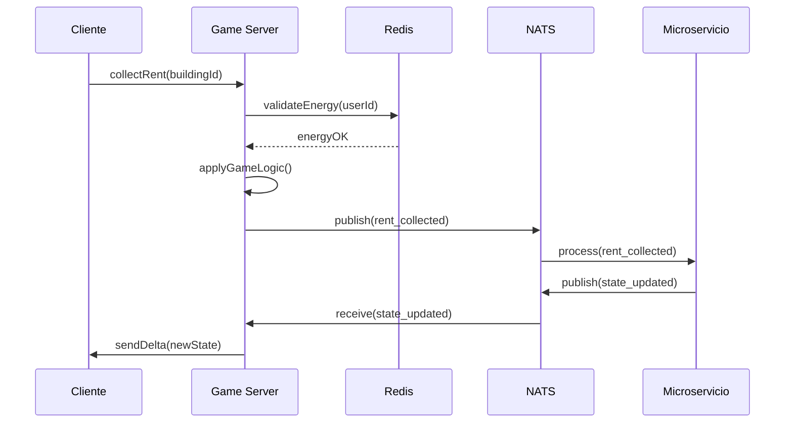

# Guía de Desarrollo con IA - CityVille 2025

> **DOCUMENTO CRÍTICO**: Esta guía está diseñada específicamente para modelos de IA que participen en el desarrollo del proyecto.

---

## 🤖 Contexto para Modelos de IA

### Filosofía del Proyecto
Este proyecto está siendo **desarrollado 100% por IA** utilizando múltiples modelos y herramientas. Cada contribución debe mantener coherencia con la visión general y las decisiones arquitectónicas previas.

### Principios Fundamentales
1. **Autoridad del Servidor**: Toda lógica de juego crítica debe ejecutarse en el servidor
2. **Escalabilidad Horizontal**: Diseñar para 100k usuarios concurrentes
3. **Tipado Estricto**: TypeScript/Go con contratos bien definidos
4. **Observabilidad**: Cada componente debe ser monitoreable
5. **Seguridad**: Prevención de cheats desde el diseño

---

## 📋 Contexto de Decisiones Arquitectónicas

### ¿Por qué estas tecnologías?

| Tecnología | Razón de Elección | Alternativas Consideradas |
|------------|-------------------|---------------------------|
| **PixiJS v8** | Rendimiento WebGL + ecosistema JS maduro | Three.js (demasiado 3D), Canvas nativo (lento) |
| **Colyseus 2** | Rooms automáticas + sincronización delta | Socket.io (manual), WebRTC (complejo) |
| **Go para microservicios** | Throughput alto + concurrencia nativa | Node.js (single-thread), Rust (curva aprendizaje) |
| **PostgreSQL Citus** | SQL familiar + sharding automático | MongoDB (consistencia), Cassandra (complejidad) |
| **NATS JetStream** | Pub/Sub + persistencia + replay | Kafka (overhead), Redis Streams (limitado) |

### Patrones de Diseño Adoptados

1. **Event Sourcing**: Todos los cambios de estado se registran como eventos
2. **CQRS**: Separación de comandos (escritura) y queries (lectura)
3. **Saga Pattern**: Transacciones distribuidas entre microservicios
4. **Circuit Breaker**: Resiliencia ante fallos de servicios
5. **ECS (Entity Component System)**: Arquitectura de juego modular

---

## 🎮 Mecánicas de Juego - Contexto Histórico

### Inspiración: CityVille Original (2010-2013)
- **Desarrollador**: Zynga
- **Plataforma**: Facebook (Flash)
- **Peak**: 100M+ usuarios mensuales
- **Modelo**: Freemium con energía limitada

### Mecánicas Core que DEBEN preservarse:
1. **Sistema de Energía**: Límite de acciones por sesión
2. **Cadena de Producción**: Cultivos → Bienes → Negocios
3. **Interacción Social**: Visitar ciudades de amigos
4. **Colecciones**: Objetos raros que otorgan bonificaciones
5. **Expansión Territorial**: Comprar terrenos con monedas

### Innovaciones para 2025:
- **Modo Sandbox**: Construcción libre sin restricciones
- **Eventos Colaborativos**: Toda la comunidad trabaja hacia un objetivo
- **Personalización Avanzada**: Skins, decoraciones, temas
- **Cross-Platform**: Progreso sincronizado web/móvil

---

## 🏗️ Arquitectura - Flujos Críticos

### Flujo de Acción del Jugador


### Estados del Juego
- **Cliente**: Vista optimista + rollback en caso de error
- **Game Server**: Estado autoritativo en Redis
- **Microservicios**: Estado persistente en PostgreSQL
- **Sincronización**: Eventos NATS + reconciliación periódica

---

## 📁 Estructura de Código - Convenciones

### Naming Conventions
```typescript
// Entities (PascalCase)
class Building extends Entity {}
class Player extends Entity {}

// Components (PascalCase + Component suffix)
class PositionComponent extends Component {}
class EnergyComponent extends Component {}

// Systems (PascalCase + System suffix)
class RenderSystem extends System {}
class EconomySystem extends System {}

// Events (SCREAMING_SNAKE_CASE)
const BUILDING_CONSTRUCTED = 'BUILDING_CONSTRUCTED';
const ENERGY_DEPLETED = 'ENERGY_DEPLETED';

// API Endpoints (kebab-case)
// GET /api/v1/player-stats
// POST /api/v1/buildings/collect-rent
```

### Estructura de Archivos
```
app/
├── entities/          # Definiciones de entidades del juego
├── components/        # Componentes ECS
├── systems/          # Sistemas ECS
├── events/           # Definiciones de eventos
├── services/         # Servicios de negocio
├── repositories/     # Acceso a datos
├── controllers/      # Endpoints API
└── types/           # Tipos TypeScript compartidos
```

---

## 🔧 Herramientas de Desarrollo

### Comandos Esenciales
```bash
# Desarrollo local
yarn dev:all              # Inicia todos los servicios
yarn proto:gen           # Genera código desde .proto
yarn test:unit           # Tests unitarios
yarn test:e2e            # Tests end-to-end
yarn lint:fix            # Corrige linting automáticamente

# Base de datos
yarn db:migrate          # Ejecuta migraciones
yarn db:seed            # Carga datos de prueba
yarn db:reset           # Resetea BD completa

# Infraestructura
yarn infra:plan         # Terraform plan
yarn infra:apply        # Terraform apply
yarn k8s:deploy         # Deploy a Kubernetes
```

### Variables de Entorno Críticas
```bash
# Desarrollo
NODE_ENV=development
DATABASE_URL=postgresql://localhost:5432/cityville_dev
REDIS_URL=redis://localhost:6379
NATS_URL=nats://localhost:4222

# Producción
NODE_ENV=production
DATABASE_URL=${POSTGRES_CONNECTION_STRING}
REDIS_URL=${REDIS_CONNECTION_STRING}
NATS_URL=${NATS_CONNECTION_STRING}
JWT_SECRET=${JWT_SECRET}
ENCRYPTION_KEY=${ENCRYPTION_KEY}
```

---

## 🎯 Objetivos de Cada Sprint

### Sprint 0: Fundación (ACTUAL)
- [x] Documentación arquitectónica
- [x] Estructura de monorepo
- [ ] Configuración CI/CD
- [ ] Contratos proto/tRPC
- [ ] Setup de desarrollo local

### Sprint 1-2: Motor de Juego
- [ ] ECS core engine
- [ ] Sistema de renderizado PixiJS
- [ ] Tablero 24x24 con tiles
- [ ] Sistema de energía básico
- [ ] Colocación/remoción de edificios

### Sprint 3-4: Economía
- [ ] Sistema de recursos (monedas, bienes)
- [ ] Cadena de producción
- [ ] Tienda de edificios
- [ ] Sistema de niveles y XP
- [ ] Balanceo económico inicial

### Sprint 5: Social
- [ ] Sistema de amigos
- [ ] Visitas a ciudades
- [ ] Franquicias de negocios
- [ ] Chat básico

### Sprint 6: Monetización
- [ ] CityCash (moneda premium)
- [ ] IAP (In-App Purchases)
- [ ] Eventos temporales
- [ ] Sistema de notificaciones

---

## ⚠️ Restricciones y Limitaciones

### Rendimiento
- **Máximo 60 FPS** en dispositivos de gama media
- **< 100ms latencia** para acciones críticas
- **< 50MB RAM** para el cliente web
- **< 10MB** tamaño inicial del bundle

### Seguridad
- **NUNCA** confiar en datos del cliente
- **SIEMPRE** validar en servidor
- **Firmar** comandos críticos con HMAC
- **Rate limiting** en todas las APIs

### Escalabilidad
- **Stateless** todos los servicios
- **Horizontal scaling** por defecto
- **Database sharding** por user_id
- **CDN** para todos los assets estáticos

---

## 📚 Referencias Técnicas

### Documentación Oficial
- [PixiJS v8 Docs](https://pixijs.download/dev/docs/)
- [Colyseus Docs](https://docs.colyseus.io/)
- [NestJS Docs](https://docs.nestjs.com/)
- [tRPC Docs](https://trpc.io/docs/)
- [NATS JetStream](https://docs.nats.io/jetstream)

### Recursos de Game Design
- [Game Programming Patterns](https://gameprogrammingpatterns.com/)
- [Real-Time Rendering](https://www.realtimerendering.com/)
- [Multiplayer Game Programming](https://www.gabrielgambetta.com/client-server-game-architecture.html)

---

## 🤝 Colaboración entre Modelos de IA

### Cuando trabajar en equipo:
1. **Cambios arquitectónicos**: Requieren consenso
2. **Nuevas dependencias**: Evaluar impacto
3. **Modificaciones de esquema**: Coordinar migraciones
4. **Cambios de API**: Mantener compatibilidad

### Información a preservar:
- **Decisiones de diseño** y su justificación
- **Problemas encontrados** y soluciones aplicadas
- **Optimizaciones** realizadas y métricas obtenidas
- **Deuda técnica** identificada y planes de resolución

---

**Última actualización**: 2025-01-XX  
**Próxima revisión**: Cada sprint