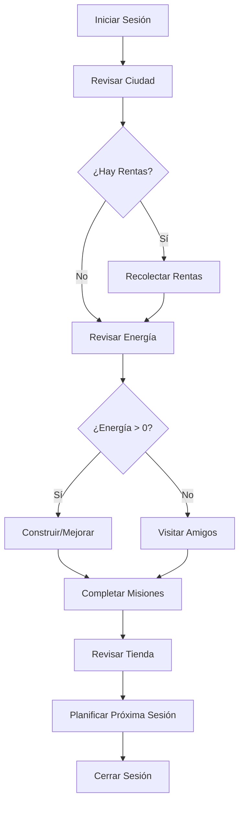

# Contexto de Game Design - CityVille 2025

> **Documento de Diseño de Juego**: Mecánicas, balanceo y decisiones de gameplay para modelos de IA.

---

## 🎮 Core Game Loop

### Flujo Principal del Jugador



### Métricas de Engagement

| Métrica | Objetivo | Actual | Notas |
|---------|----------|--------|---------|
| **Sesión Promedio** | 8-12 min | TBD | Tiempo óptimo para mobile |
| **Sesiones/Día** | 3-5 | TBD | Picos: mañana, almuerzo, noche |
| **Retención D1** | >70% | TBD | Primera impresión crítica |
| **Retención D7** | >35% | TBD | Hábito formado |
| **Retención D30** | >15% | TBD | Jugador comprometido |

---

## ⚡ Sistema de Energía

### Mecánica Core

```typescript
interface EnergySystem {
  maxEnergy: number;        // 30 por defecto
  currentEnergy: number;    // Estado actual
  rechargeRate: number;     // 1 punto cada 5 minutos
  lastUpdate: number;       // Timestamp última actualización
}

// Cálculo de energía
function calculateCurrentEnergy(player: Player): number {
  const now = Date.now();
  const timeDiff = now - player.energy.lastUpdate;
  const minutesPassed = Math.floor(timeDiff / (1000 * 60));
  const energyToAdd = Math.floor(minutesPassed / 5); // 1 energía cada 5 min
  
  return Math.min(
    player.energy.maxEnergy,
    player.energy.currentEnergy + energyToAdd
  );
}
```

### Costos de Energía

| Acción | Costo | Justificación |
|--------|-------|---------------|
| **Construir Edificio** | 3-5 | Acción principal, debe ser limitada |
| **Recolectar Renta** | 1 | Acción frecuente, bajo costo |
| **Mejorar Edificio** | 2-4 | Progresión, costo medio |
| **Limpiar Terreno** | 2 | Expansión, preparación |
| **Plantar Cultivo** | 1 | Producción básica |
| **Cosechar** | 1 | Completar ciclo producción |
| **Ayudar Amigo** | 0 | Fomentar interacción social |

### Monetización de Energía

```typescript
// Opciones de compra de energía
const ENERGY_PACKAGES = {
  SMALL: { energy: 10, cityCash: 5, value: 'good' },
  MEDIUM: { energy: 25, cityCash: 10, value: 'better' },
  LARGE: { energy: 50, cityCash: 18, value: 'best' },
  FULL: { energy: 999, cityCash: 25, value: 'premium' }
};

// Energía gratis por tiempo
const FREE_ENERGY_SOURCES = {
  DAILY_LOGIN: 5,           // Cada día
  LEVEL_UP: 10,            // Al subir nivel
  FRIEND_GIFT: 3,          // Regalo de amigo
  AD_WATCH: 5,             // Ver anuncio (3 veces/día)
  ACHIEVEMENT: 10          // Completar logro
};
```

---

## 🏗️ Sistema de Edificios

### Categorías de Edificios

#### 1. Residenciales (Generan Población)

```typescript
interface ResidentialBuilding {
  type: 'residential';
  populationCapacity: number;
  rentAmount: number;
  rentInterval: number; // minutos
  upgradeLevels: number;
}

const RESIDENTIAL_BUILDINGS = {
  HOUSE: {
    populationCapacity: 4,
    rentAmount: 25,
    rentInterval: 60,      // 1 hora
    upgradeLevels: 5,
    cost: 100
  },
  APARTMENT: {
    populationCapacity: 12,
    rentAmount: 75,
    rentInterval: 120,     // 2 horas
    upgradeLevels: 5,
    cost: 500
  },
  MANSION: {
    populationCapacity: 2,
    rentAmount: 200,
    rentInterval: 240,     // 4 horas
    upgradeLevels: 3,
    cost: 2000
  }
};
```

#### 2. Comerciales (Generan Ingresos)

```typescript
interface CommercialBuilding {
  type: 'commercial';
  requiredPopulation: number;
  profitAmount: number;
  profitInterval: number;
  requiredGoods?: string[];
}

const COMMERCIAL_BUILDINGS = {
  BAKERY: {
    requiredPopulation: 8,
    profitAmount: 50,
    profitInterval: 30,    // 30 minutos
    requiredGoods: ['wheat'],
    cost: 200
  },
  RESTAURANT: {
    requiredPopulation: 15,
    profitAmount: 120,
    profitInterval: 60,    // 1 hora
    requiredGoods: ['vegetables', 'meat'],
    cost: 800
  },
  MALL: {
    requiredPopulation: 50,
    profitAmount: 500,
    profitInterval: 180,   // 3 horas
    requiredGoods: ['electronics', 'clothing'],
    cost: 5000
  }
};
```

#### 3. Productivos (Generan Bienes)

```typescript
interface ProductiveBuilding {
  type: 'productive';
  producedGood: string;
  productionTime: number;
  capacity: number;
}

const PRODUCTIVE_BUILDINGS = {
  FARM: {
    producedGood: 'wheat',
    productionTime: 15,    // 15 minutos
    capacity: 4,           // 4 cultivos simultáneos
    cost: 50
  },
  FACTORY: {
    producedGood: 'electronics',
    productionTime: 120,   // 2 horas
    capacity: 2,
    cost: 1500
  },
  RANCH: {
    producedGood: 'meat',
    productionTime: 60,    // 1 hora
    capacity: 6,
    cost: 400
  }
};
```

### Sistema de Mejoras

```typescript
interface BuildingUpgrade {
  level: number;
  costMultiplier: number;
  benefitMultiplier: number;
  requiredLevel: number;
}

// Fórmulas de mejora
function calculateUpgradeCost(baseCost: number, currentLevel: number): number {
  return Math.floor(baseCost * Math.pow(1.5, currentLevel - 1));
}

function calculateUpgradeBenefit(baseValue: number, level: number): number {
  return Math.floor(baseValue * (1 + (level - 1) * 0.25)); // +25% por nivel
}

// Ejemplo: Casa nivel 1 → nivel 2
// Costo: 100 * 1.5^(2-1) = 150 monedas
// Renta: 25 * (1 + (2-1) * 0.25) = 31.25 ≈ 31 monedas
```

---

## 💰 Sistema Económico

### Monedas Duales

#### Monedas (Gratis)
```typescript
interface CoinSources {
  RENT_COLLECTION: number;     // Principal fuente
  BUSINESS_PROFIT: number;     // Negocios abastecidos
  QUEST_REWARDS: number;       // Completar misiones
  FRIEND_VISITS: number;       // Interacción social
  LEVEL_UP_BONUS: number;      // Progresión
}

const COIN_ECONOMY = {
  SOURCES: {
    RENT_COLLECTION: 0.7,      // 70% de ingresos
    BUSINESS_PROFIT: 0.2,      // 20% de ingresos
    QUEST_REWARDS: 0.05,       // 5% de ingresos
    OTHER: 0.05                // 5% de ingresos
  },
  SINKS: {
    BUILDING_PURCHASE: 0.6,    // 60% del gasto
    BUILDING_UPGRADES: 0.25,   // 25% del gasto
    LAND_EXPANSION: 0.1,       // 10% del gasto
    DECORATIONS: 0.05          // 5% del gasto
  }
};
```

#### CityCash (Premium)
```typescript
interface CityCashSources {
  IAP_PURCHASE: number;        // Compra directa
  DAILY_REWARDS: number;       // Login diario
  ACHIEVEMENTS: number;        // Logros especiales
  EVENTS: number;              // Eventos temporales
}

const CITYCASH_ECONOMY = {
  SOURCES: {
    IAP_PURCHASE: 0.85,        // 85% de CityCash
    DAILY_REWARDS: 0.08,       // 8% de CityCash
    ACHIEVEMENTS: 0.04,        // 4% de CityCash
    EVENTS: 0.03               // 3% de CityCash
  },
  USES: {
    ENERGY_REFILL: 0.4,        // 40% del gasto
    PREMIUM_BUILDINGS: 0.3,    // 30% del gasto
    TIME_SKIP: 0.2,            // 20% del gasto
    DECORATIONS: 0.1           // 10% del gasto
  }
};
```

### Balanceo Económico

```typescript
// Progresión de ingresos por nivel
function calculateLevelIncome(playerLevel: number): number {
  const baseIncome = 100; // Monedas por hora en nivel 1
  return Math.floor(baseIncome * Math.pow(1.15, playerLevel - 1));
}

// Progresión de costos por nivel
function calculateLevelCosts(playerLevel: number): number {
  const baseCost = 200; // Costo edificio básico nivel 1
  return Math.floor(baseCost * Math.pow(1.12, playerLevel - 1));
}

// Tiempo para próximo edificio (objetivo: 2-3 sesiones)
function timeToNextBuilding(playerLevel: number): number {
  const income = calculateLevelIncome(playerLevel);
  const cost = calculateLevelCosts(playerLevel);
  return cost / income; // Horas de juego necesarias
}
```

---

## 🎯 Sistema de Misiones

### Tipos de Misiones

#### 1. Tutorial (Onboarding)
```typescript
const TUTORIAL_QUESTS = [
  {
    id: 'tutorial_01',
    title: 'Construye tu primera casa',
    description: 'Coloca una casa en tu ciudad',
    objectives: [{ type: 'build', target: 'house', count: 1 }],
    rewards: { coins: 50, xp: 25, cityCash: 2 },
    order: 1
  },
  {
    id: 'tutorial_02',
    title: 'Recolecta tu primera renta',
    description: 'Espera 1 minuto y recolecta la renta',
    objectives: [{ type: 'collect_rent', count: 1 }],
    rewards: { coins: 25, xp: 15 },
    order: 2
  },
  {
    id: 'tutorial_03',
    title: 'Construye una panadería',
    description: 'Los negocios generan más ingresos',
    objectives: [{ type: 'build', target: 'bakery', count: 1 }],
    rewards: { coins: 100, xp: 50, cityCash: 5 },
    order: 3
  }
];
```

#### 2. Diarias (Engagement)
```typescript
const DAILY_QUESTS = [
  {
    id: 'daily_collect',
    title: 'Recolector Diario',
    description: 'Recolecta 10 rentas',
    objectives: [{ type: 'collect_rent', count: 10 }],
    rewards: { coins: 200, xp: 100 },
    resetTime: '00:00:00' // Medianoche UTC
  },
  {
    id: 'daily_social',
    title: 'Buen Vecino',
    description: 'Visita 3 ciudades de amigos',
    objectives: [{ type: 'visit_friends', count: 3 }],
    rewards: { coins: 150, xp: 75, energy: 5 },
    resetTime: '00:00:00'
  },
  {
    id: 'daily_build',
    title: 'Constructor',
    description: 'Construye o mejora 2 edificios',
    objectives: [{ type: 'build_or_upgrade', count: 2 }],
    rewards: { coins: 300, xp: 150, cityCash: 3 },
    resetTime: '00:00:00'
  }
];
```

#### 3. Semanales (Retención)
```typescript
const WEEKLY_QUESTS = [
  {
    id: 'weekly_expansion',
    title: 'Expansión Semanal',
    description: 'Expande tu ciudad comprando 5 terrenos',
    objectives: [{ type: 'buy_land', count: 5 }],
    rewards: { coins: 2000, xp: 500, cityCash: 25 },
    duration: 7 * 24 * 60 * 60 * 1000 // 7 días
  },
  {
    id: 'weekly_social',
    title: 'Líder Comunitario',
    description: 'Ayuda a 20 amigos en sus ciudades',
    objectives: [{ type: 'help_friends', count: 20 }],
    rewards: { coins: 1500, xp: 400, energy: 20 },
    duration: 7 * 24 * 60 * 60 * 1000
  }
];
```

### Sistema de Progreso

```typescript
interface QuestProgress {
  questId: string;
  playerId: string;
  objectives: ObjectiveProgress[];
  startedAt: number;
  completedAt?: number;
  claimed: boolean;
}

interface ObjectiveProgress {
  type: string;
  target?: string;
  current: number;
  required: number;
  completed: boolean;
}

// Actualización de progreso
function updateQuestProgress(
  playerId: string, 
  action: GameAction
): QuestProgress[] {
  const activeQuests = getActiveQuests(playerId);
  const updatedQuests: QuestProgress[] = [];
  
  activeQuests.forEach(quest => {
    let updated = false;
    
    quest.objectives.forEach(objective => {
      if (!objective.completed && matchesObjective(action, objective)) {
        objective.current = Math.min(
          objective.current + 1, 
          objective.required
        );
        objective.completed = objective.current >= objective.required;
        updated = true;
      }
    });
    
    if (updated) {
      // Verificar si toda la misión está completa
      const allCompleted = quest.objectives.every(obj => obj.completed);
      if (allCompleted && !quest.completedAt) {
        quest.completedAt = Date.now();
        // Trigger notification
        notifyQuestCompleted(playerId, quest.questId);
      }
      
      updatedQuests.push(quest);
    }
  });
  
  return updatedQuests;
}
```

---

## 👥 Sistema Social

### Mecánicas de Amistad

#### 1. Visitas a Ciudades
```typescript
interface CityVisit {
  visitorId: string;
  hostId: string;
  timestamp: number;
  actionsPerformed: VisitAction[];
  rewardsEarned: Rewards;
}

interface VisitAction {
  type: 'help_building' | 'send_gift' | 'franchise_business';
  targetId: string;
  reward: number;
}

// Límites de visita
const VISIT_LIMITS = {
  MAX_VISITS_PER_DAY: 10,        // Máximo 10 amigos por día
  MAX_ACTIONS_PER_VISIT: 5,      // 5 acciones por visita
  ENERGY_COST: 0,                // Visitas no cuestan energía
  COOLDOWN_BETWEEN_VISITS: 0     // Sin cooldown
};

// Recompensas por ayudar
const HELP_REWARDS = {
  VISITOR: {
    coins: 10,                   // Por cada ayuda
    xp: 5,
    friendship: 1
  },
  HOST: {
    coins: 5,                    // Cuando te ayudan
    xp: 2,
    friendship: 1
  }
};
```

#### 2. Sistema de Regalos
```typescript
interface Gift {
  id: string;
  senderId: string;
  recipientId: string;
  type: GiftType;
  sentAt: number;
  claimedAt?: number;
}

enum GiftType {
  ENERGY = 'energy',           // +3 energía
  COINS = 'coins',             // +50 monedas
  MATERIALS = 'materials',     // Materiales de construcción
  DECORATIONS = 'decorations'  // Decoraciones especiales
}

// Límites de regalos
const GIFT_LIMITS = {
  MAX_SEND_PER_DAY: 20,        // Máximo enviar 20 regalos/día
  MAX_RECEIVE_PER_DAY: 50,     // Máximo recibir 50 regalos/día
  EXPIRY_TIME: 7 * 24 * 60 * 60 * 1000, // Expiran en 7 días
  FRIENDSHIP_BONUS: 2          // +2 amistad por regalo
};
```

#### 3. Franquicias de Negocios
```typescript
interface Franchise {
  businessId: string;
  ownerId: string;
  franchiseeId: string;
  profitShare: number;         // % de ganancias para el franquiciado
  duration: number;            // Duración en milisegundos
  createdAt: number;
}

// Mecánica de franquicia
const FRANCHISE_SYSTEM = {
  PROFIT_SHARE: 0.15,          // 15% de ganancias para el amigo
  MAX_FRANCHISES: 3,           // Máximo 3 franquicias activas
  DURATION: 24 * 60 * 60 * 1000, // 24 horas
  FRIENDSHIP_REQUIRED: 50,     // Nivel de amistad mínimo
  COOLDOWN: 6 * 60 * 60 * 1000   // 6 horas entre franquicias
};

// Cálculo de ganancias
function calculateFranchiseProfit(
  baseProfit: number, 
  franchise: Franchise
): { owner: number; franchisee: number } {
  const franchiseeShare = Math.floor(baseProfit * franchise.profitShare);
  const ownerShare = baseProfit - franchiseeShare;
  
  return {
    owner: ownerShare,
    franchisee: franchiseeShare
  };
}
```

---

## 🎪 Sistema de Eventos

### Eventos Temporales

#### 1. Eventos Semanales
```typescript
interface WeeklyEvent {
  id: string;
  name: string;
  description: string;
  startDate: number;
  endDate: number;
  type: EventType;
  rewards: EventReward[];
  requirements: EventRequirement[];
}

enum EventType {
  BUILDING_BONUS = 'building_bonus',     // Bonificación construcción
  DOUBLE_COINS = 'double_coins',         // Doble monedas
  ENERGY_DISCOUNT = 'energy_discount',   // Descuento energía
  SPECIAL_BUILDINGS = 'special_buildings' // Edificios únicos
}

// Ejemplo: Evento "Fiebre Constructora"
const BUILDING_FEVER_EVENT = {
  id: 'building_fever_2025_01',
  name: 'Fiebre Constructora',
  description: 'Construye edificios con 50% menos energía',
  startDate: Date.parse('2025-01-15T00:00:00Z'),
  endDate: Date.parse('2025-01-22T23:59:59Z'),
  type: EventType.ENERGY_DISCOUNT,
  modifiers: {
    buildingEnergyCost: 0.5  // 50% descuento
  },
  rewards: [
    {
      milestone: 5,   // 5 edificios construidos
      reward: { coins: 1000, cityCash: 10 }
    },
    {
      milestone: 15,  // 15 edificios construidos
      reward: { coins: 3000, cityCash: 25, decoration: 'golden_statue' }
    }
  ]
};
```

#### 2. Eventos Estacionales
```typescript
// Evento Navidad
const CHRISTMAS_EVENT = {
  id: 'christmas_2025',
  name: 'Navidad en CityVille',
  description: 'Decora tu ciudad para las fiestas',
  duration: 14 * 24 * 60 * 60 * 1000, // 2 semanas
  specialBuildings: [
    {
      id: 'christmas_tree',
      name: 'Árbol de Navidad',
      cost: { cityCash: 50 },
      effect: { happiness: 25, coinBonus: 0.1 }
    },
    {
      id: 'santa_workshop',
      name: 'Taller de Santa',
      cost: { coins: 5000 },
      produces: 'christmas_gifts',
      productionTime: 60 // 1 hora
    }
  ],
  collectibles: [
    'candy_cane', 'snowflake', 'bell', 'star', 'wreath'
  ],
  finalReward: {
    coins: 10000,
    cityCash: 100,
    exclusiveBuilding: 'santas_house'
  }
};
```

### Sistema de Colecciones

```typescript
interface Collection {
  id: string;
  name: string;
  items: CollectionItem[];
  completionReward: Rewards;
  repeatable: boolean;
}

interface CollectionItem {
  id: string;
  name: string;
  rarity: 'common' | 'uncommon' | 'rare' | 'epic' | 'legendary';
  dropRate: number; // Probabilidad 0-1
  sources: string[]; // Dónde se puede obtener
}

// Ejemplo: Colección "Tesoros de la Ciudad"
const CITY_TREASURES_COLLECTION = {
  id: 'city_treasures',
  name: 'Tesoros de la Ciudad',
  items: [
    {
      id: 'old_coin',
      name: 'Moneda Antigua',
      rarity: 'common',
      dropRate: 0.3,
      sources: ['building_construction', 'land_clearing']
    },
    {
      id: 'rare_gem',
      name: 'Gema Rara',
      rarity: 'rare',
      dropRate: 0.05,
      sources: ['building_upgrade', 'friend_visit']
    },
    {
      id: 'golden_key',
      name: 'Llave Dorada',
      rarity: 'legendary',
      dropRate: 0.01,
      sources: ['quest_completion', 'event_participation']
    }
  ],
  completionReward: {
    coins: 5000,
    cityCash: 50,
    exclusiveBuilding: 'treasure_vault'
  },
  repeatable: true
};
```

---

## 📊 Métricas y Balanceo

### KPIs de Gameplay

```typescript
interface GameplayMetrics {
  // Engagement
  averageSessionLength: number;    // Objetivo: 8-12 minutos
  sessionsPerDay: number;          // Objetivo: 3-5
  daysPlayed: number;              // Días activos
  
  // Progresión
  buildingsBuilt: number;
  levelsGained: number;
  questsCompleted: number;
  
  // Economía
  coinsEarned: number;
  coinsSpent: number;
  cityCashSpent: number;
  
  // Social
  friendsAdded: number;
  friendVisits: number;
  giftsExchanged: number;
  
  // Monetización
  iapPurchases: number;
  totalSpent: number;
  adsWatched: number;
}

// Segmentación de jugadores
enum PlayerSegment {
  TUTORIAL = 'tutorial',           // Primeros 3 días
  CASUAL = 'casual',               // Juega esporádicamente
  REGULAR = 'regular',             // Juega diariamente
  HARDCORE = 'hardcore',           // Múltiples sesiones/día
  WHALE = 'whale',                 // Alto gasto en IAP
  CHURNED = 'churned'              // No juega hace 7+ días
}

// Balanceo por segmento
function getBalanceForSegment(segment: PlayerSegment) {
  switch (segment) {
    case PlayerSegment.TUTORIAL:
      return {
        energyRechargeRate: 0.8,     // 20% más rápido
        coinMultiplier: 1.5,         // 50% más monedas
        questXpBonus: 2.0            // Doble XP
      };
    
    case PlayerSegment.CASUAL:
      return {
        energyRechargeRate: 1.0,     // Normal
        coinMultiplier: 1.2,         // 20% más monedas
        questXpBonus: 1.0            // XP normal
      };
    
    case PlayerSegment.HARDCORE:
      return {
        energyRechargeRate: 1.0,     // Normal
        coinMultiplier: 1.0,         // Monedas normales
        questXpBonus: 1.0,           // XP normal
        exclusiveContent: true       // Contenido exclusivo
      };
    
    default:
      return {
        energyRechargeRate: 1.0,
        coinMultiplier: 1.0,
        questXpBonus: 1.0
      };
  }
}
```

### A/B Testing Framework

```typescript
interface ABTest {
  id: string;
  name: string;
  description: string;
  variants: ABVariant[];
  trafficAllocation: number;       // % de usuarios en el test
  startDate: number;
  endDate: number;
  metrics: string[];               // Métricas a medir
  status: 'draft' | 'running' | 'completed' | 'paused';
}

interface ABVariant {
  id: string;
  name: string;
  allocation: number;              // % de tráfico para esta variante
  config: Record<string, any>;     // Configuración específica
}

// Ejemplo: Test de energía inicial
const ENERGY_TEST = {
  id: 'energy_starting_amount_v1',
  name: 'Energía Inicial',
  description: 'Probar diferentes cantidades de energía inicial',
  variants: [
    {
      id: 'control',
      name: 'Control (30 energía)',
      allocation: 0.5,
      config: { startingEnergy: 30 }
    },
    {
      id: 'variant_a',
      name: 'Más Energía (50 energía)',
      allocation: 0.5,
      config: { startingEnergy: 50 }
    }
  ],
  trafficAllocation: 0.1,          // 10% de nuevos usuarios
  metrics: ['retention_d1', 'retention_d7', 'session_length', 'iap_conversion'],
  status: 'running'
};
```

---

## 🎨 Feedback y Juice

### Principios de UX

1. **Feedback Inmediato**: Toda acción debe tener respuesta visual/auditiva
2. **Anticipación**: Animaciones que preparan al usuario para el resultado
3. **Satisfacción**: Efectos que hacen sentir bien al completar acciones
4. **Claridad**: El estado del juego siempre debe ser obvio

### Implementación de Juice

```typescript
// Sistema de efectos visuales
interface JuiceEffect {
  type: 'scale' | 'shake' | 'glow' | 'particles' | 'sound';
  duration: number;
  intensity: number;
  trigger: string;
}

const JUICE_EFFECTS = {
  BUILDING_PLACED: [
    { type: 'scale', duration: 300, intensity: 1.2, trigger: 'onPlace' },
    { type: 'particles', duration: 1000, intensity: 0.8, trigger: 'onPlace' },
    { type: 'sound', duration: 0, intensity: 1.0, trigger: 'onPlace' }
  ],
  
  RENT_COLLECTED: [
    { type: 'glow', duration: 500, intensity: 1.5, trigger: 'onCollect' },
    { type: 'scale', duration: 200, intensity: 1.1, trigger: 'onCollect' },
    { type: 'sound', duration: 0, intensity: 0.8, trigger: 'onCollect' }
  ],
  
  LEVEL_UP: [
    { type: 'shake', duration: 800, intensity: 2.0, trigger: 'onLevelUp' },
    { type: 'particles', duration: 2000, intensity: 1.5, trigger: 'onLevelUp' },
    { type: 'sound', duration: 0, intensity: 1.2, trigger: 'onLevelUp' }
  ]
};

// Sistema de sonidos
const SOUND_LIBRARY = {
  UI_CLICK: 'ui_click.mp3',
  BUILDING_PLACE: 'building_place.mp3',
  COIN_COLLECT: 'coin_collect.mp3',
  LEVEL_UP: 'level_up.mp3',
  QUEST_COMPLETE: 'quest_complete.mp3',
  ERROR: 'error.mp3',
  AMBIENT_CITY: 'ambient_city.mp3'
};
```

---

**Mantenimiento**: Revisar balanceo cada 2 semanas basado en métricas  
**Validación**: A/B testing continuo para optimizar engagement  
**Evolución**: Iterar mecánicas basado en feedback de jugadores y datos