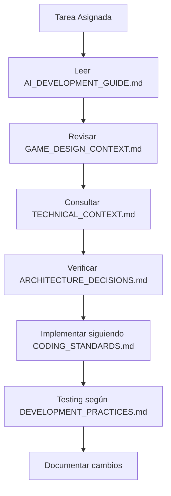
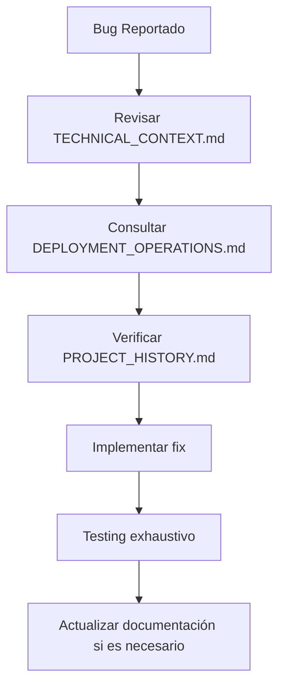
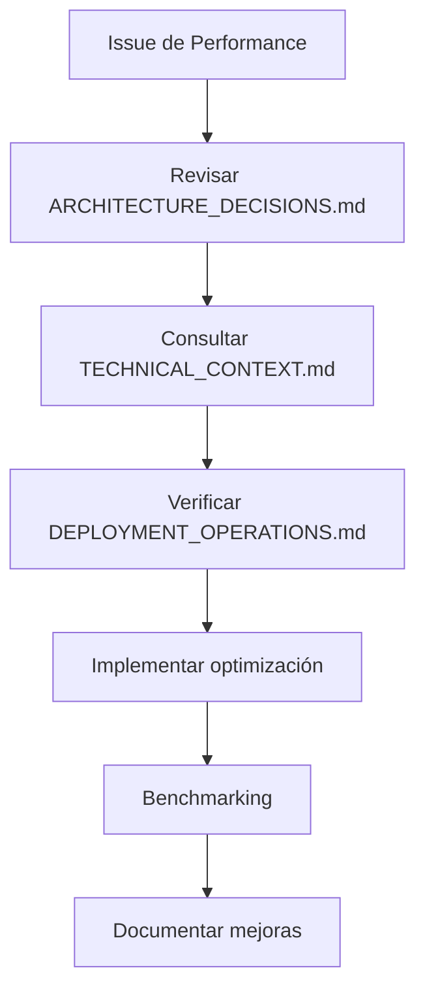
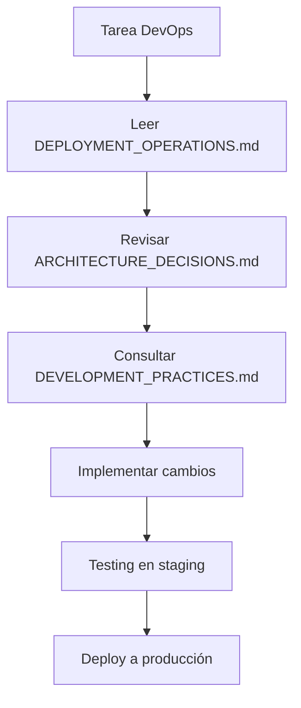

# Documentación CityVille 2025 - Índice Principal

> **Centro de Documentación para Desarrollo con IA**: Guía completa para modelos de IA trabajando en el proyecto CityVille 2025.

---

## 🎯 Propósito de esta Documentación

Esta documentación está específicamente diseñada para **desarrollo 100% con IA**. Cada archivo proporciona contexto detallado, patrones establecidos y referencias técnicas para que los modelos de IA puedan:

- ✅ Entender completamente la arquitectura y objetivos del proyecto
- ✅ Mantener consistencia en decisiones técnicas y de diseño
- ✅ Implementar funcionalidades siguiendo patrones establecidos
- ✅ Resolver problemas con contexto histórico completo
- ✅ Colaborar efectivamente entre diferentes sesiones de IA

---

## 📚 Estructura de la Documentación

### 🏗️ **Documentación Fundamental**

| Archivo | Propósito | Cuándo Usar |
|---------|-----------|-------------|
| **[AI_DEVELOPMENT_GUIDE.md](./AI_DEVELOPMENT_GUIDE.md)** | Guía principal para desarrollo con IA | **SIEMPRE** - Leer primero en cada sesión |
| **[PROJECT_HISTORY.md](./PROJECT_HISTORY.md)** | Historia y evolución del proyecto | Al necesitar contexto de decisiones pasadas |
| **[ARCHITECTURE_DECISIONS.md](./ARCHITECTURE_DECISIONS.md)** | ADRs y decisiones arquitectónicas | Al trabajar con arquitectura o tecnologías |

### 🎮 **Contexto de Juego y Diseño**

| Archivo | Propósito | Cuándo Usar |
|---------|-----------|-------------|
| **[GAME_DESIGN_CONTEXT.md](./GAME_DESIGN_CONTEXT.md)** | Mecánicas, balanceo y UX del juego | Al implementar funcionalidades de gameplay |

### 💻 **Implementación Técnica**

| Archivo | Propósito | Cuándo Usar |
|---------|-----------|-------------|
| **[TECHNICAL_CONTEXT.md](./TECHNICAL_CONTEXT.md)** | APIs, esquemas DB, contratos | Al implementar APIs o trabajar con datos |
| **[CODING_STANDARDS.md](./CODING_STANDARDS.md)** | Convenciones y estándares de código | Al escribir cualquier código |
| **[DEVELOPMENT_PRACTICES.md](./DEVELOPMENT_PRACTICES.md)** | Testing, calidad y contribución | Al escribir tests o hacer refactoring |

### 🚀 **Operaciones y Deployment**

| Archivo | Propósito | Cuándo Usar |
|---------|-----------|-------------|
| **[DEPLOYMENT_OPERATIONS.md](./DEPLOYMENT_OPERATIONS.md)** | Deployment, configuración, monitoreo | Al trabajar con infraestructura o DevOps |

---

## 🚀 Guía de Inicio Rápido para IA

### 1️⃣ **Primera Sesión con el Proyecto**

```markdown
1. 📖 Leer [AI_DEVELOPMENT_GUIDE.md](./AI_DEVELOPMENT_GUIDE.md) completamente
2. 📖 Revisar [PROJECT_HISTORY.md](./PROJECT_HISTORY.md) para contexto
3. 🎯 Identificar el área de trabajo (frontend, backend, infraestructura)
4. 📖 Leer documentación específica según el área:
   - Frontend: GAME_DESIGN_CONTEXT.md + TECHNICAL_CONTEXT.md
   - Backend: ARCHITECTURE_DECISIONS.md + TECHNICAL_CONTEXT.md
   - DevOps: DEPLOYMENT_OPERATIONS.md
5. 📖 Revisar [CODING_STANDARDS.md](./CODING_STANDARDS.md) antes de escribir código
```

### 2️⃣ **Sesiones Subsecuentes**

```markdown
1. 📖 Revisar [AI_DEVELOPMENT_GUIDE.md](./AI_DEVELOPMENT_GUIDE.md) (sección relevante)
2. 🔍 Consultar documentación específica según la tarea
3. ✅ Verificar patrones en [CODING_STANDARDS.md](./CODING_STANDARDS.md)
4. 🧪 Seguir prácticas de [DEVELOPMENT_PRACTICES.md](./DEVELOPMENT_PRACTICES.md)
```

### 3️⃣ **Resolución de Problemas**

```markdown
1. 🔍 Buscar en [ARCHITECTURE_DECISIONS.md](./ARCHITECTURE_DECISIONS.md)
2. 📖 Revisar [PROJECT_HISTORY.md](./PROJECT_HISTORY.md) para problemas similares
3. 🛠️ Consultar [DEPLOYMENT_OPERATIONS.md](./DEPLOYMENT_OPERATIONS.md) para troubleshooting
```

---

## 🎯 Flujos de Trabajo por Tipo de Tarea

### 🏗️ **Desarrollo de Nueva Funcionalidad**



### 🐛 **Corrección de Bugs**



### ⚡ **Optimización de Performance**



### 🚀 **Deployment y DevOps**



---

## 📋 Checklist de Calidad para IA

### ✅ **Antes de Implementar**

- [ ] He leído la documentación relevante para mi tarea
- [ ] Entiendo el contexto histórico de las decisiones
- [ ] Conozco los patrones arquitectónicos a seguir
- [ ] He verificado las convenciones de código
- [ ] Entiendo las mecánicas de juego involucradas

### ✅ **Durante la Implementación**

- [ ] Sigo los estándares de código establecidos
- [ ] Implemento logging y observabilidad apropiados
- [ ] Manejo errores según los patrones establecidos
- [ ] Uso los tipos y interfaces definidos
- [ ] Respeto las restricciones de performance

### ✅ **Después de Implementar**

- [ ] He escrito tests apropiados
- [ ] La documentación está actualizada
- [ ] He verificado que no rompo funcionalidad existente
- [ ] El código pasa todas las validaciones de calidad
- [ ] He considerado el impacto en otros componentes

---

## 🔍 Búsqueda Rápida de Información

### 🎮 **Mecánicas de Juego**

| Busco información sobre... | Archivo | Sección |
|---------------------------|---------|----------|
| Sistema de energía | GAME_DESIGN_CONTEXT.md | Energy System |
| Economía del juego | GAME_DESIGN_CONTEXT.md | Dual Economic System |
| Sistema de edificios | GAME_DESIGN_CONTEXT.md | Building System |
| Misiones y quests | GAME_DESIGN_CONTEXT.md | Quest System |
| Sistema social | GAME_DESIGN_CONTEXT.md | Social System |
| Eventos temporales | GAME_DESIGN_CONTEXT.md | Event System |

### 💻 **Implementación Técnica**

| Busco información sobre... | Archivo | Sección |
|---------------------------|---------|----------|
| Esquemas de base de datos | TECHNICAL_CONTEXT.md | PostgreSQL Schema |
| APIs y endpoints | TECHNICAL_CONTEXT.md | tRPC API |
| Servicios gRPC | TECHNICAL_CONTEXT.md | gRPC Services |
| WebSocket events | TECHNICAL_CONTEXT.md | WebSocket Events |
| Event Sourcing | TECHNICAL_CONTEXT.md | Event Sourcing con NATS |
| Autenticación | TECHNICAL_CONTEXT.md | Autenticación y Autorización |
| Observabilidad | TECHNICAL_CONTEXT.md | Observabilidad |

### 🏗️ **Arquitectura y Decisiones**

| Busco información sobre... | Archivo | Sección |
|---------------------------|---------|----------|
| Microservicios | ARCHITECTURE_DECISIONS.md | ADR-001 |
| PixiJS y rendering | ARCHITECTURE_DECISIONS.md | ADR-002 |
| Entity Component System | ARCHITECTURE_DECISIONS.md | ADR-003 |
| Base de datos | ARCHITECTURE_DECISIONS.md | ADR-004 |
| Messaging | ARCHITECTURE_DECISIONS.md | ADR-005 |
| APIs type-safe | ARCHITECTURE_DECISIONS.md | ADR-006 |
| Real-time gaming | ARCHITECTURE_DECISIONS.md | ADR-007 |
| Kubernetes | ARCHITECTURE_DECISIONS.md | ADR-008 |

### 🚀 **DevOps y Deployment**

| Busco información sobre... | Archivo | Sección |
|---------------------------|---------|----------|
| Configuración Docker | DEPLOYMENT_OPERATIONS.md | Configuración Docker |
| Helm charts | DEPLOYMENT_OPERATIONS.md | Configuración Kubernetes |
| Variables de entorno | DEPLOYMENT_OPERATIONS.md | Variables de Entorno |
| Monitoreo | DEPLOYMENT_OPERATIONS.md | Monitoreo y Alertas |
| Troubleshooting | DEPLOYMENT_OPERATIONS.md | Troubleshooting |
| Seguridad | DEPLOYMENT_OPERATIONS.md | Seguridad Operacional |

### 🧪 **Testing y Calidad**

| Busco información sobre... | Archivo | Sección |
|---------------------------|---------|----------|
| Estrategia de testing | DEVELOPMENT_PRACTICES.md | Estrategia de Testing |
| Unit testing | DEVELOPMENT_PRACTICES.md | Unit Testing Patterns |
| Integration testing | DEVELOPMENT_PRACTICES.md | Integration Testing |
| E2E testing | DEVELOPMENT_PRACTICES.md | E2E Testing con Playwright |
| ESLint config | DEVELOPMENT_PRACTICES.md | ESLint Configuration |
| Code review | DEVELOPMENT_PRACTICES.md | Code Review Guidelines |
| CI/CD | DEVELOPMENT_PRACTICES.md | GitHub Actions Workflow |

---

## 🔄 Mantenimiento de la Documentación

### 📅 **Frecuencia de Actualización**

- **Semanal**: AI_DEVELOPMENT_GUIDE.md (objetivos de sprint)
- **Por release**: PROJECT_HISTORY.md (changelog)
- **Por cambio arquitectónico**: ARCHITECTURE_DECISIONS.md
- **Por cambio de mecánicas**: GAME_DESIGN_CONTEXT.md
- **Por cambio de APIs**: TECHNICAL_CONTEXT.md
- **Por cambio de proceso**: DEVELOPMENT_PRACTICES.md
- **Por cambio de infra**: DEPLOYMENT_OPERATIONS.md

### 🔍 **Indicadores de Documentación Desactualizada**

- ❌ Código que no sigue los patrones documentados
- ❌ APIs que no coinciden con los esquemas
- ❌ Configuraciones que difieren de los ejemplos
- ❌ Tests que no siguen las prácticas establecidas
- ❌ Deployment que falla por configuración obsoleta

### ✅ **Proceso de Actualización**

1. **Identificar cambio**: ¿Qué documentación se ve afectada?
2. **Actualizar contenido**: Modificar la documentación relevante
3. **Verificar consistencia**: Revisar referencias cruzadas
4. **Validar ejemplos**: Asegurar que los ejemplos funcionen
5. **Comunicar cambios**: Notificar al equipo (IA) sobre actualizaciones

---

## 🤖 Instrucciones Específicas para Modelos de IA

### 🎯 **Al Comenzar una Nueva Sesión**

```markdown
1. SIEMPRE leer AI_DEVELOPMENT_GUIDE.md primero
2. Identificar el tipo de tarea (desarrollo, bug fix, optimización, etc.)
3. Seguir el flujo de trabajo correspondiente
4. Consultar documentación específica según necesidad
5. Verificar patrones y convenciones antes de implementar
```

### 🔍 **Al Encontrar Información Conflictiva**

```markdown
1. AI_DEVELOPMENT_GUIDE.md tiene la mayor prioridad
2. ARCHITECTURE_DECISIONS.md para decisiones técnicas
3. PROJECT_HISTORY.md para contexto de cambios
4. En caso de duda, seguir el patrón más reciente
```

### 📝 **Al Actualizar Documentación**

```markdown
1. Mantener el formato y estructura existente
2. Agregar ejemplos prácticos cuando sea posible
3. Incluir referencias cruzadas a otros documentos
4. Actualizar el índice si es necesario
5. Verificar que los enlaces funcionen
```

### 🚨 **Señales de Alerta**

```markdown
- Si el código existente no sigue los patrones documentados
- Si las APIs no coinciden con los esquemas
- Si los tests fallan por configuración obsoleta
- Si el deployment falla por documentación incorrecta

→ ACTUALIZAR la documentación correspondiente
```

---

## 📞 Contacto y Soporte

### 🤝 **Para Modelos de IA**

- **Documentación incompleta**: Crear issue describiendo la información faltante
- **Patrones inconsistentes**: Documentar el conflicto y proponer solución
- **Ejemplos que no funcionan**: Reportar y corregir en la documentación

### 📊 **Métricas de Calidad de Documentación**

- ✅ **Completitud**: ¿Toda la información necesaria está disponible?
- ✅ **Actualidad**: ¿La documentación refleja el estado actual?
- ✅ **Claridad**: ¿Los ejemplos son claros y funcionales?
- ✅ **Consistencia**: ¿Los patrones son consistentes entre documentos?
- ✅ **Utilidad**: ¿La documentación ayuda a completar tareas efectivamente?

---

**Última actualización**: Enero 2025  
**Versión de documentación**: 1.0.0  
**Mantenido por**: Equipo de Desarrollo IA CityVille 2025